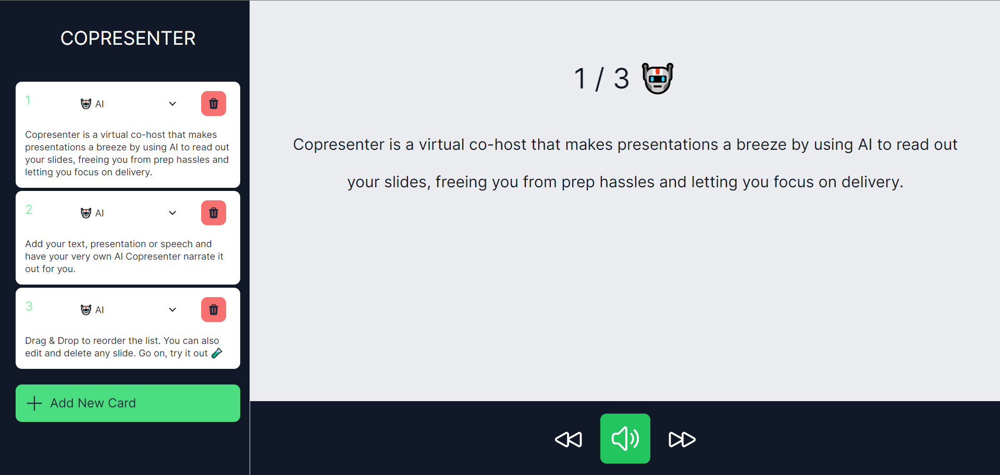

# Copresenter

Copresenter is a virtual co-host that makes presentations a breeze by using AI to read out your slides, freeing you from prep hassles and letting you focus on delivery.


[](https://copresenter.vercel.app/)

## How it works

Save time, enhance your delivery, and focus on perfecting your presentation's content. With our service, simply input your text or speech into a new speaking card and our service automatically generates a lifelike narration using the [ElevenLabs](https://elevenlabs.io/) text-to-speech AI.

Additionally,  Copresenter offers customizable speaking cards displayed clearly on the UI for ease of reading, elevating your workflow and helping you make effortless presentations.

## Stack
- ElevenLabs
- Next.JS
- Vercel
- Tailwind

## Running Locally

### Clone the repository to your local machine.

```bash
git clone https://github.com/FelixWaweru/Copresenter
```

### Install the dependencies.

```bash
pnpm install
```

### Run the application.

Finally, run the application in the command line. It will be served at `http://localhost:3000`.

```bash
pnpm run dev
```